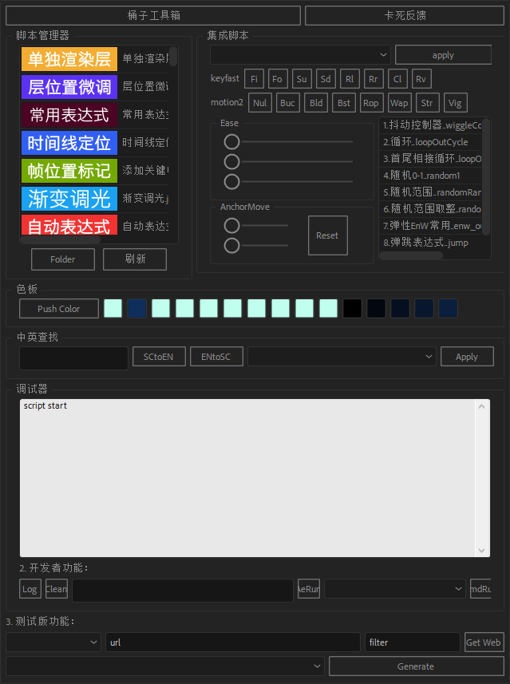

# AeGlobalController
a global controller script with autoSync of all After Effects CompItem

## 全局同步属性控制器v2.1.0  by 水桶
插件通过提供所有合成的控制器同步、对当前选中属性抽出放入控制器
来完成如运动统一、配色统一等进行统一控制的功能

## usage

0. 下载jsx文件
1. 复制到``ScriptUI Panels``文件夹（如``C:\Program Files\Adobe\Adobe After Effects CC 2015.3\Support Files\Scripts\ScriptUI Panels``）
2. 重启Ae后于``工具栏-窗口``底部

## warning

英文版暂未支持，可手动修改源码中文字符到英文。

## 关于我
[个人网页](https://v.guediao.top)
QQ: 864689103
BilibiliID: DDL水桶
